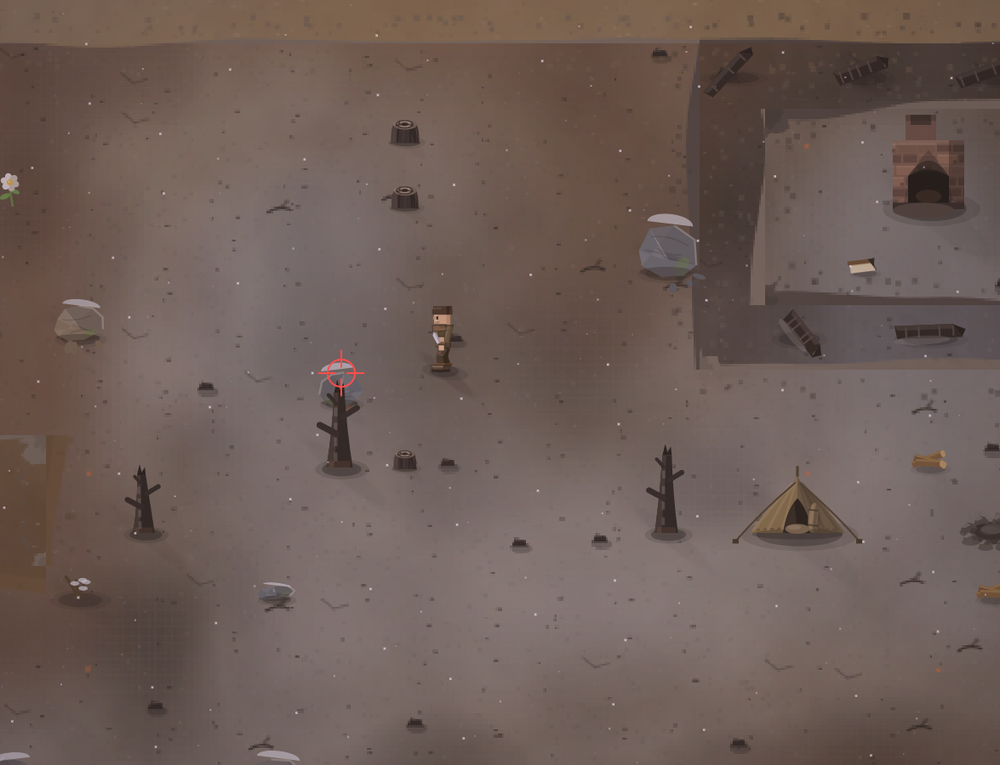

# Снег не прилегается. Снег парит над камнем. И почему зимой инфраструктура всего не меняет? а как же снег на земле и прочие детали?

- **зона:** Пепелище у дома (`ashfall`)
- **точка:** x 785, y 1122 (тайл 24,35)
- **время:** день 85, 19:01, winter
- **погода:** snow
- **зум:** 2.4
- **повторить:** `node tools/scene.js --zone ashfall --at 785,1122 --hour 19 --weather snow --zoom 2.4`

<!-- 2026-10-07T02:08:12.792Z -->
