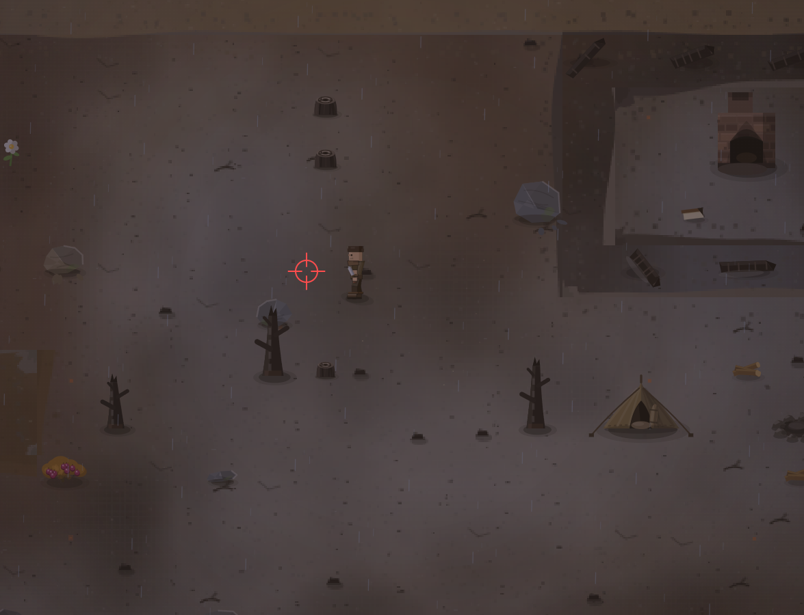

# Почему бы не сделать последствия дождя? Ну лужи, слякоть и прочие детали?

- **зона:** Пепелище у дома (`ashfall`)
- **точка:** x 804, y 1104 (тайл 25,34)
- **время:** день 57, 20:00, autumn
- **погода:** rain
- **зум:** 2.4
- **повторить:** `node tools/scene.js --zone ashfall --at 804,1104 --day 57 --hour 20 --weather rain --zoom 2.4`

<!-- 2026-10-07T02:08:53.898Z -->

## Исправление — 2026-10-07

**Статус:** исправлено в `8bc588d`, этап 56. Проверено тестами и
кадрами софт-рендера; визуальная приёмка владельцем — в превью.

Добавлена сохраняемая влажность: дождь/гроза насыщают землю, после
прояснения она постепенно высыхает. Есть лужи, грязная кромка, рябь,
мокрые следы и брызги шагов. Для проверки последствий, а не первых секунд
дождя, добавь к команде **`--wet 0.85`** либо нажми «После ливня» в пульте.
`npm run surface` → `02-note-rain.png`, `06-after-rain.png`, `07-dried.png`.

Исходный кадр выше сохранён без изменений. Подробности —
[CHANGELOG, этап 56](../CHANGELOG.md).
