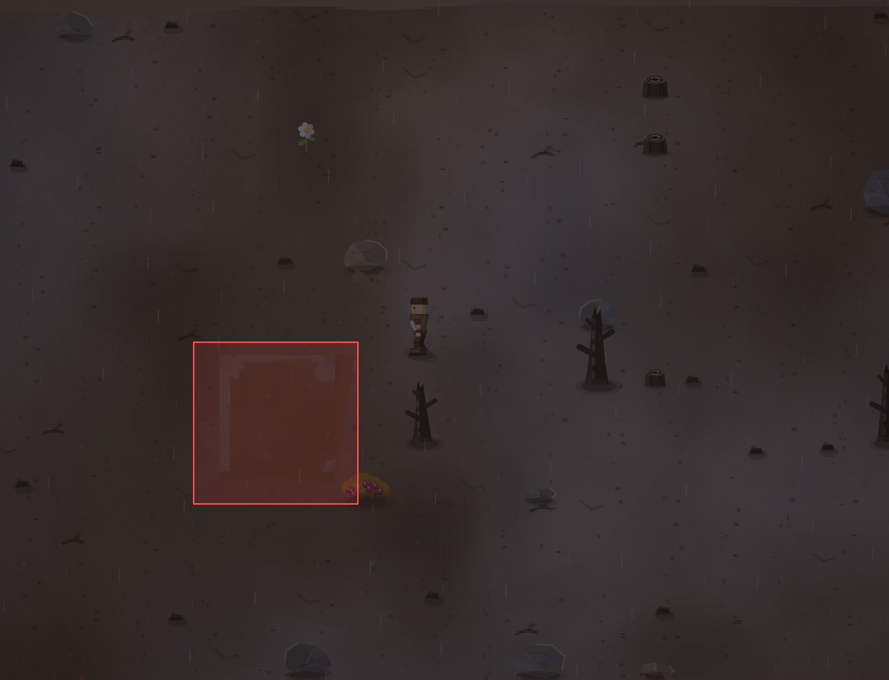

# Это что у нас тут?

- **зона:** Пепелище у дома (`ashfall`)
- **область:** 90×89 px от (562, 1145) — тайлы 17,35 … 20,38
- **время:** день 57, 20:28, autumn
- **погода:** rain
- **зум:** 2.4
- **повторить:** `node tools/scene.js --zone ashfall --at 607,1190 --day 57 --hour 20.466666666666665 --weather rain --zoom 2.4`

<!-- 2026-10-07T02:09:13.140Z -->

## Исправление — 2026-10-07

**Статус:** исправлено в `8bc588d`, этап 56. Проверено тестами и
кадрами софт-рендера; визуальная приёмка владельцем — в превью.

Это были четыре тайла земли `(18,36)…(19,37)` среди пепла, а не объект.
Рамку создавали однотонные полосы и угловые вставки перехода. Заменено
непрерывным смешиванием цвета и деталей земли/пепла/гари в мировых
координатах. Карта, сид и коллизии не изменены.
`npm run surface` → `03-note-ground.png`, `04-ground-noon.png`.

Исходный кадр выше сохранён без изменений. Подробности —
[CHANGELOG, этап 56](../CHANGELOG.md).
