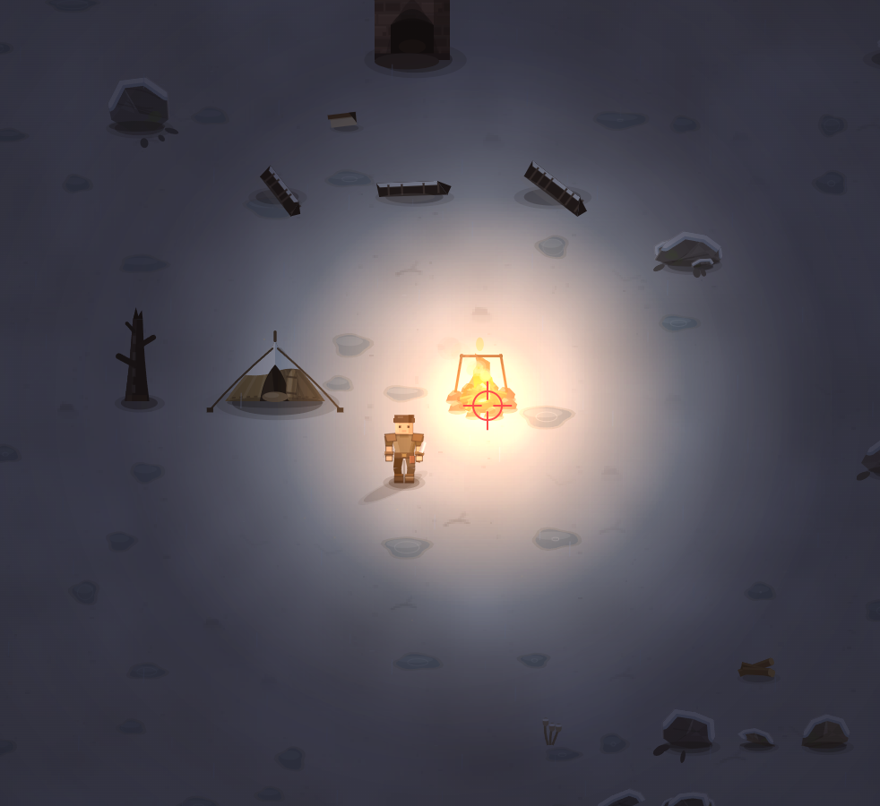

# Зимой и в дождь, ну в непогоду тяжко с костром. добавь это

- **зона:** Пепелище у дома (`ashfall`)
- **точка:** x 1107, y 1202 (тайл 34,37)
- **время:** день 85, 20:48, winter
- **погода:** rain
- **зум:** 2.4
- **повторить:** `node tools/scene.js --zone ashfall --at 1107,1202 --day 85 --hour 20.8 --weather rain --wet 1 --zoom 2.4 --seed 1066618561`

<!-- 2026-10-07T11:58:56.936Z -->
