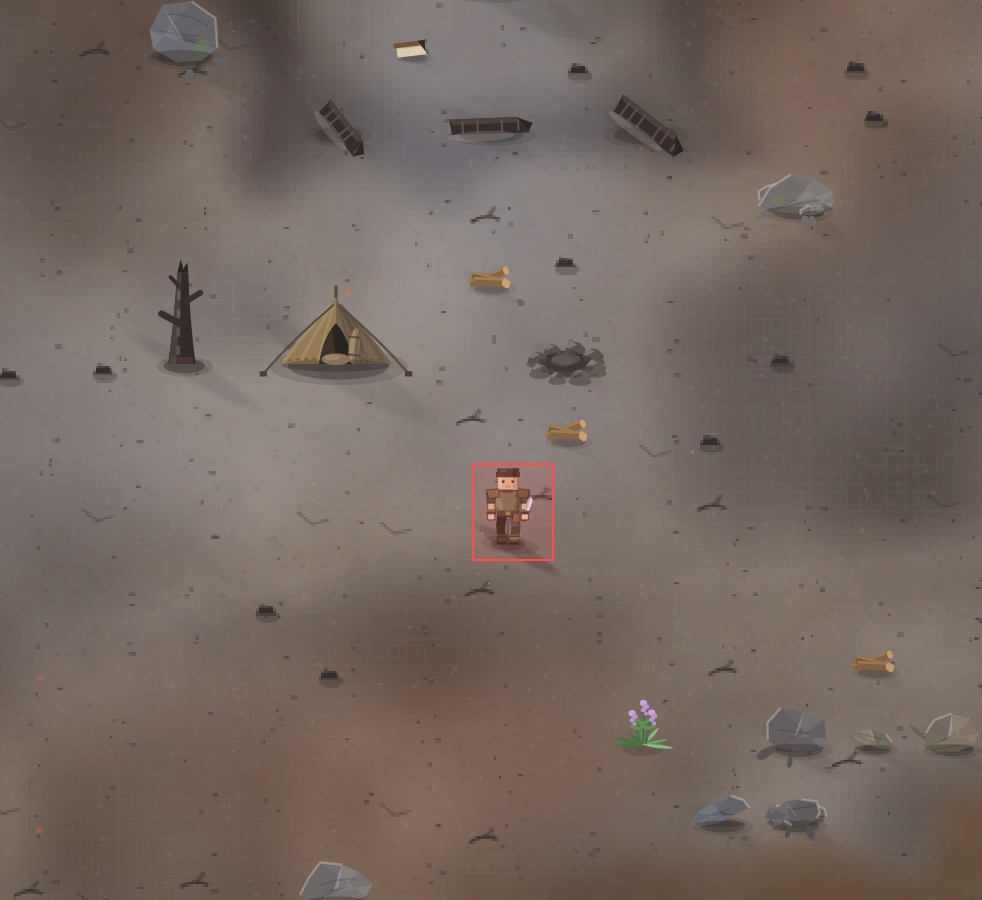

# Надо бы улучшить вид человека. Сделать более оживленным.

- **зона:** Пепелище у дома (`ashfall`)
- **область:** 33×40 px от (1065, 1242) — тайлы 33,38 … 34,40
- **время:** день 1, 17:57, spring
- **погода:** cloudy
- **зум:** 2.4
- **повторить:** `node tools/scene.js --zone ashfall --at 1082,1262 --day 1 --hour 17.95 --weather cloudy --wet 0 --zoom 2.4 --seed 1066618561`

<!-- 2026-10-07T12:01:20.919Z -->

## Обработка — 2026-10-07, этап 57

**Статус:** Реализовано, визуальная приёмка открыта. Код: `5dc481f`.

Смягчены силуэт плеч и челюсти, добавлены небольшие движения головы/кисти и ткани. Сохранены дистанционный цикл шага, IK ног и неподвижность таза поперёк движения. Общий художник применяется ко всем персонажам. Проверены 40 поз с топором и 40 с факелом; это доработка процедурного героя, не замена на другую стилистику.

Проверки: `npm test` — 244/244; `npm run environment` — воспроизведение
с числовым сидом и контекстом заметки. Кадры проверены в софт-рендере;
нативная браузерная приёмка владельцем — в превью. Исходная заметка и PNG
сохранены. Подробности: [CHANGELOG, этап 57](../CHANGELOG.md).
