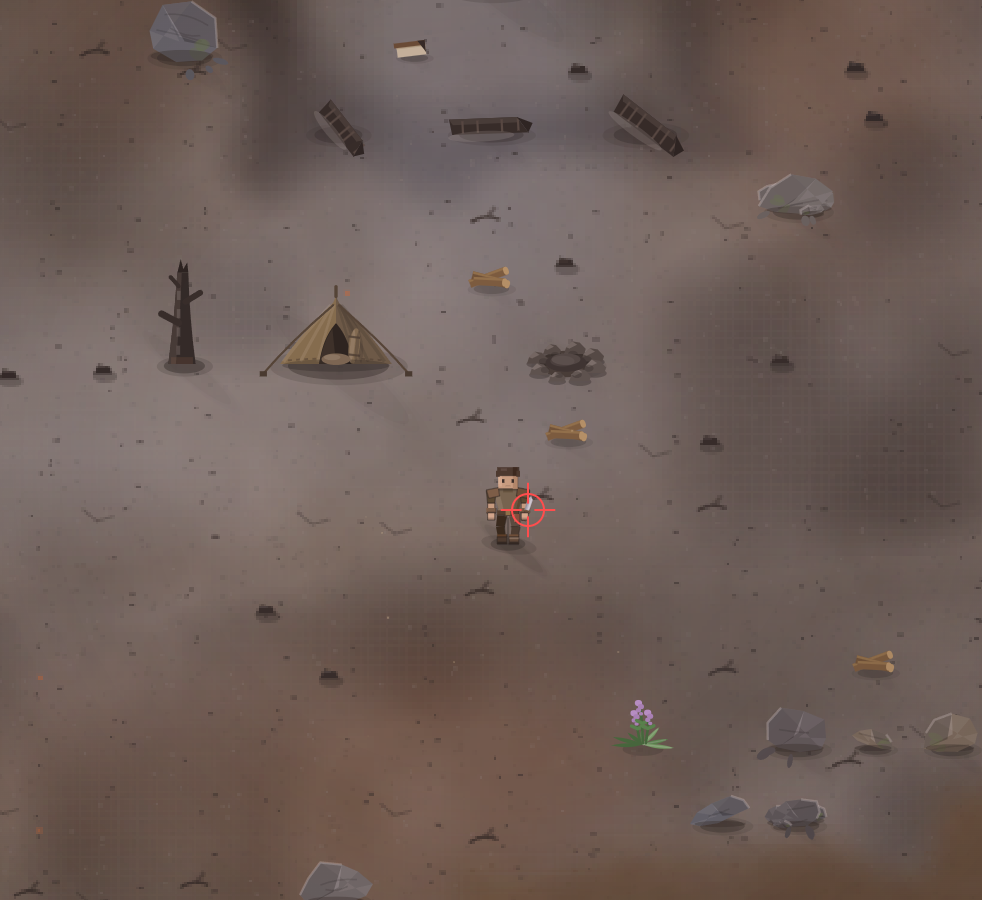

# Предмет в руке всё время перемещает на сторону вида камеры, и вообще перенеси действующую руку на правую.

- **зона:** Пепелище у дома (`ashfall`)
- **точка:** x 1088, y 1261 (тайл 34,39)
- **время:** день 1, 18:58, spring
- **погода:** cloudy
- **зум:** 2.4
- **повторить:** `node tools/scene.js --zone ashfall --at 1088,1261 --day 1 --hour 18.966666666666665 --weather cloudy --wet 0 --zoom 2.4 --seed 1066618561`

<!-- 2026-10-07T12:02:04.263Z -->
