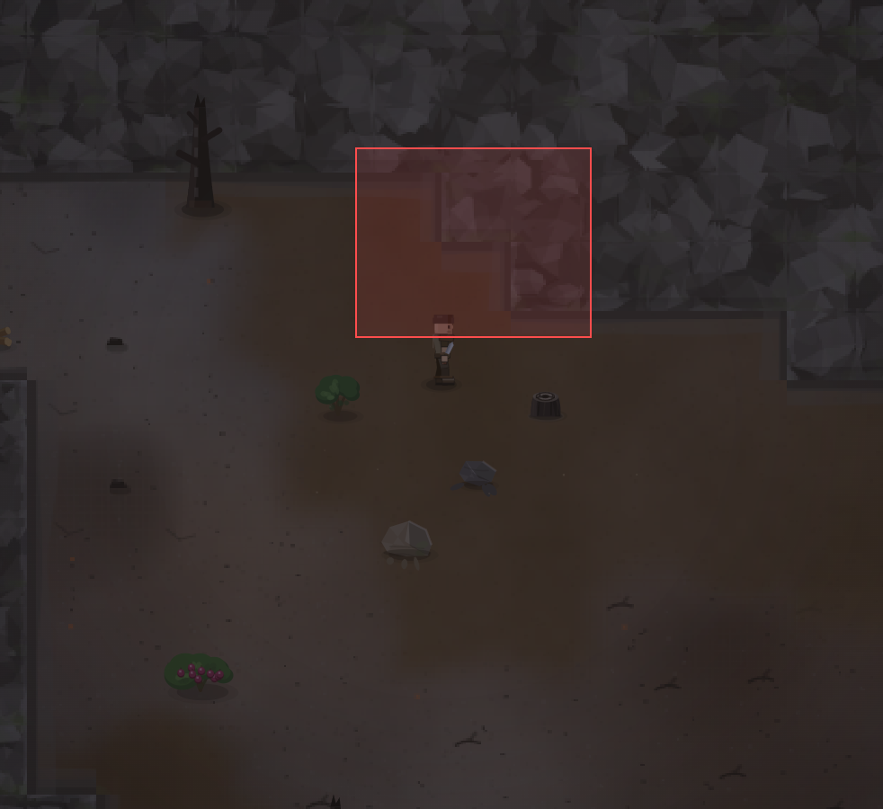

# Что за прямые углы?

- **зона:** Пепелище у дома (`ashfall`)
- **область:** 109×88 px от (248, 117) — тайлы 7,3 … 11,6
- **время:** день 1, 20:44, spring
- **погода:** cloudy
- **зум:** 2.4
- **повторить:** `node tools/scene.js --zone ashfall --at 303,161 --day 1 --hour 20.733333333333334 --weather cloudy --wet 0 --zoom 2.4 --seed 1066618561`

<!-- 2026-10-07T12:03:18.228Z -->
