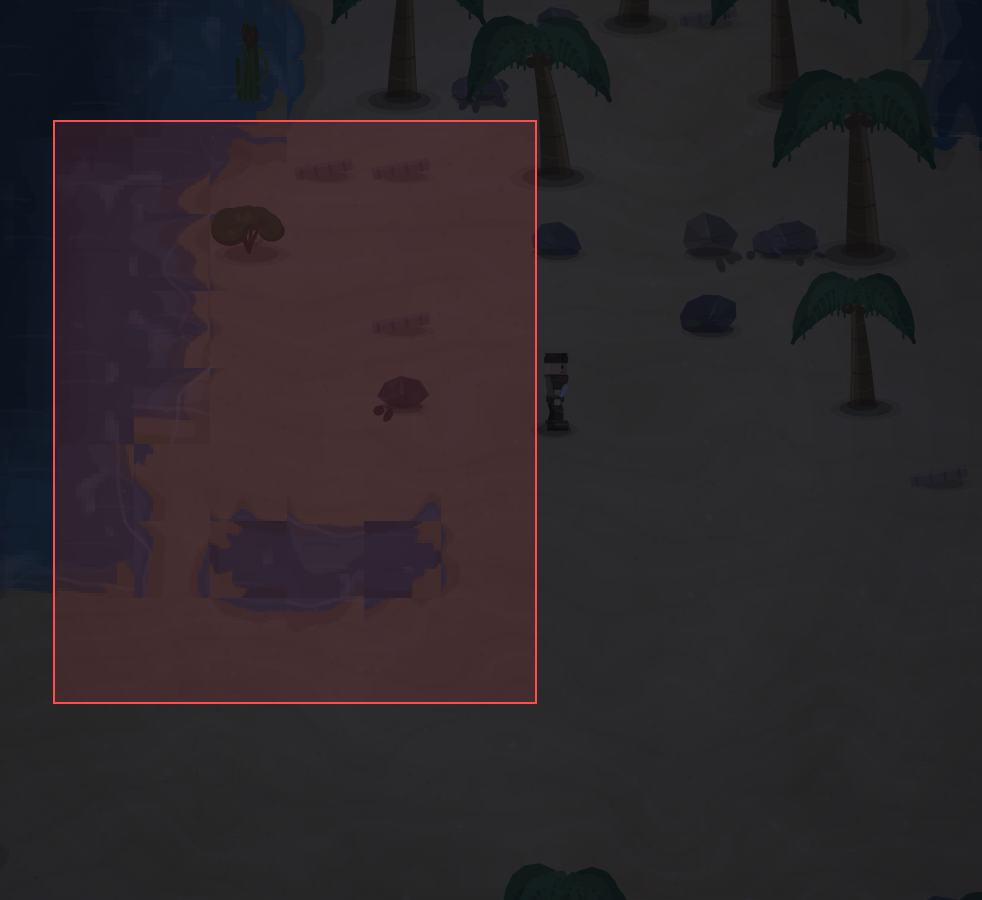

# Выглядит уж очень некрасиво, во первых много прямых углов, далее прямоугольная форма в которой расположена вода. Надо бы с геометрическими формами рельефа поработать.

- **зона:** Лазурный берег (`shore`)
- **область:** 201×243 px от (2079, 665) — тайлы 64,20 … 71,28
- **время:** день 1, 23:31, spring
- **погода:** cloudy
- **зум:** 2.4
- **повторить:** `node tools/scene.js --zone shore --at 2180,787 --day 1 --hour 23.516666666666666 --weather cloudy --wet 0 --zoom 2.4 --seed 1066618561`

<!-- 2026-10-07T12:05:15.718Z -->

## Обработка — 2026-10-07, этап 57

**Статус:** Исправлено, визуальная приёмка открыта. Код: `5dc481f`.

Вместо независимых краёв каждого тайла — общая форма берега/водоёма. Убраны прямоугольные накладки воды; рябь и отражения проверяют тот же контур, что движение. Дождевой слой больше не кладёт квадратное затемнение поверх нового берега. Дневной контрольный кадр: 015-coast-noon.png.

Проверки: `npm test` — 244/244; `npm run environment` — воспроизведение
с числовым сидом и контекстом заметки. Кадры проверены в софт-рендере;
нативная браузерная приёмка владельцем — в превью. Исходная заметка и PNG
сохранены. Подробности: [CHANGELOG, этап 57](../CHANGELOG.md).
