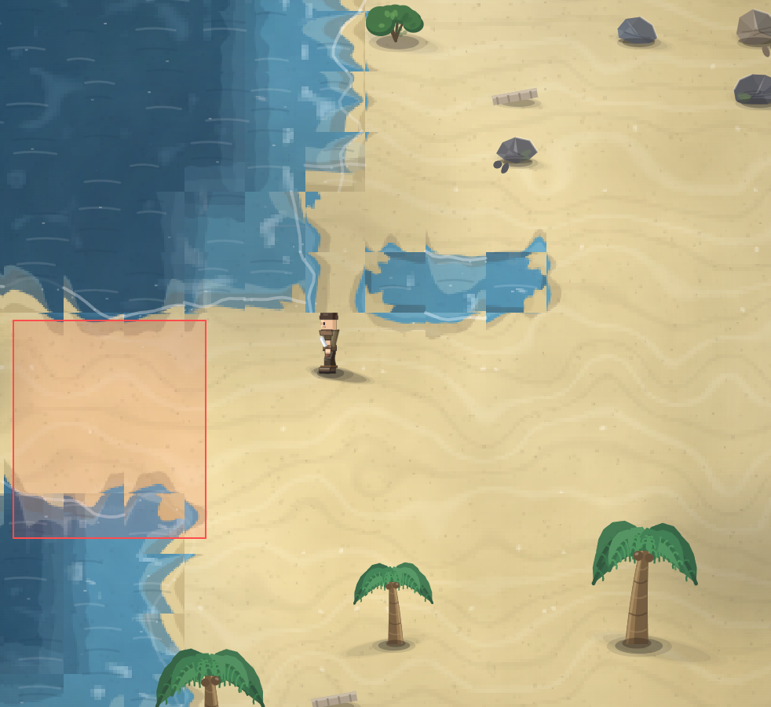

# дорога посреди море. убираем. не бывает дороги посреди море. материки, локации и прочие луты, которые за морем, оставляем. В процессе разработки добавим возможности переплыть и тогда игрок сможет открыть для себя что-то новое.

- **зона:** Лазурный берег (`shore`)
- **область:** 102×115 px от (1957, 868) — тайлы 61,27 … 64,30
- **время:** день 1, 09:58, spring
- **погода:** cloudy
- **зум:** 2.4
- **повторить:** `node tools/scene.js --zone shore --at 2008,926 --day 1 --hour 9.966666666666667 --weather cloudy --wet 0 --zoom 2.4 --seed 1066618561`

<!-- 2026-10-07T12:06:45.864Z -->

## Обработка — 2026-10-07, этап 57

**Статус:** Исправлено. Код: `5dc481f`.

Морская насыпь восстановлена в воду, но исходные острова и содержимое объектов не удалены. Порядок генерации добычи сохранён: на seed 1066618561 остаются все 321 объект с исходными параметрами, что проверяется хешем из версии 7503f9b. 314 объектов остаются точно на прежних местах; 7 с бывшей насыпи перенесены на ближайшую настоящую сушу. Дальние земли оставлены для будущего плавания; само плавание этим этапом не добавлено.

Проверки: `npm test` — 244/244; `npm run environment` — воспроизведение
с числовым сидом и контекстом заметки. Кадры проверены в софт-рендере;
нативная браузерная приёмка владельцем — в превью. Исходная заметка и PNG
сохранены. Подробности: [CHANGELOG, этап 57](../CHANGELOG.md).
