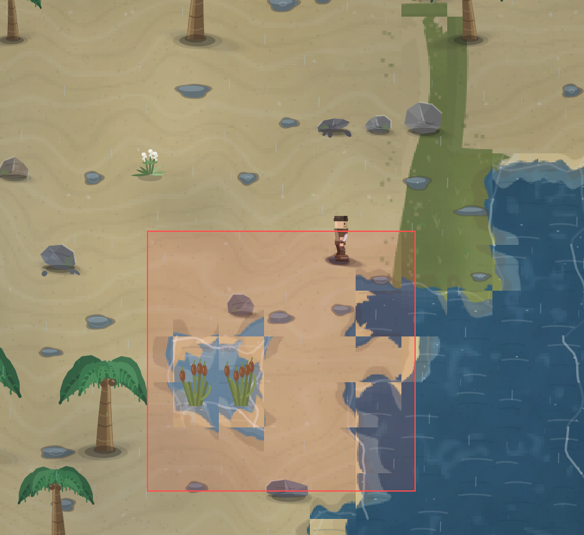

# Естественно всё то же самое, квадратная форма рельефа.

- **зона:** Лазурный берег (`shore`)
- **область:** 188×182 px от (2254, 1174) — тайлы 70,36 … 76,42
- **время:** день 1, 11:39, spring
- **погода:** rain
- **зум:** 2.4
- **повторить:** `node tools/scene.js --zone shore --at 2348,1265 --day 1 --hour 11.65 --weather rain --wet 1 --zoom 2.4 --seed 1066618561`

<!-- 2026-10-07T12:07:56.830Z -->
