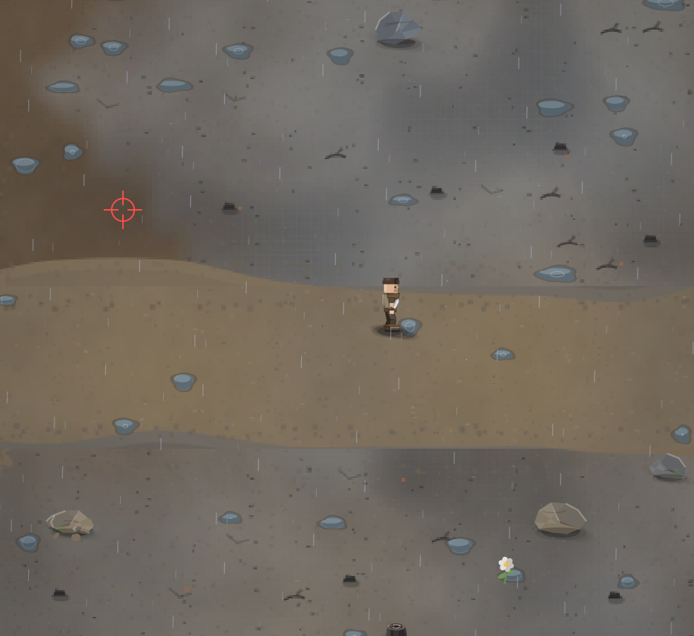

# А мы можем как-то поработать над рельефом? Чтоб иметь холмы, горы и прочие детали, а не простой плоский мир.

- **зона:** Пепелище у дома (`ashfall`)
- **точка:** x 175, y 819 (тайл 5,25)
- **время:** день 1, 13:12, spring
- **погода:** rain
- **зум:** 2.4
- **повторить:** `node tools/scene.js --zone ashfall --at 175,819 --day 1 --hour 13.2 --weather rain --wet 1 --zoom 2.4 --seed 1066618561`

<!-- 2026-10-07T12:09:01.712Z -->

## Обработка — 2026-10-07, этап 57

**Статус:** Частично выполнено — НЕ закрыта. Код: `5dc481f`.

Добавлена детерминированная карта высот, затенение по нормали поверхности и замедление подъёма; в горных биомах больше скальных участков. Это только основа рельефа. Ещё нужны визуально объёмные холмы/горы, уступы с отображением высоты объектов и согласованные переходы между уровнями. Нынешнее затенение не считается полноценной многоуровневой геометрией. Продолжить отдельным большим блоком, не подменять задачу усилением контраста.

Проверки: `npm test` — 244/244; `npm run environment` — воспроизведение
с числовым сидом и контекстом заметки. Кадры проверены в софт-рендере;
нативная браузерная приёмка владельцем — в превью. Исходная заметка и PNG
сохранены. Подробности: [CHANGELOG, этап 57](../CHANGELOG.md).

## Продолжение — 2026-10-07, этап 58

**Статус:** По-прежнему частично выполнено — весь мир не переведён на объёмный рельеф.
Код стенда: `79a472f`.

Добавлен отдельный `dev/relief.html`: проходимый холм, терраса, отвесный
уступ и пологий проход. Общая функция высоты управляет проекцией подошв и
предметов, замедлением подъёма и коллизиями; дерево/камень имеют опору и
блокирующие основания, хворост берётся только с доступного уровня.
Геометрия и объекты сортируются вместе по глубине — это не накладная тень
поверх плоской карты. Движение проверено на 30/60/120 FPS.

Стенд не меняет зоны/сейвы основной игры. Пока нет мостов, прыжков,
пещер под террасой и авторского оформления гор. Расширение мира —
только после отдельной приёмки этого прототипа.

### Продолжение · этап 60 · 2026-10-07

После одобрения стенда добавлен **отдельный дневной игровой участок**
`?relief=1`: настоящий Player, выносливость, рюкзак, сбор хвороста и костёр,
блокировка обрыва и взаимодействия через перепад высоты. Основной сейв
не затрагивается; пробный прогресс живёт только в памяти текущего запуска.
Ссылка есть на стенде и в пульте. Весь мир на эту геометрию не переведён:
статус 011 по-прежнему **частично**. Ночной/сезонный рендер и несколько
поверхностей на одной координате остаются отдельными задачами.
