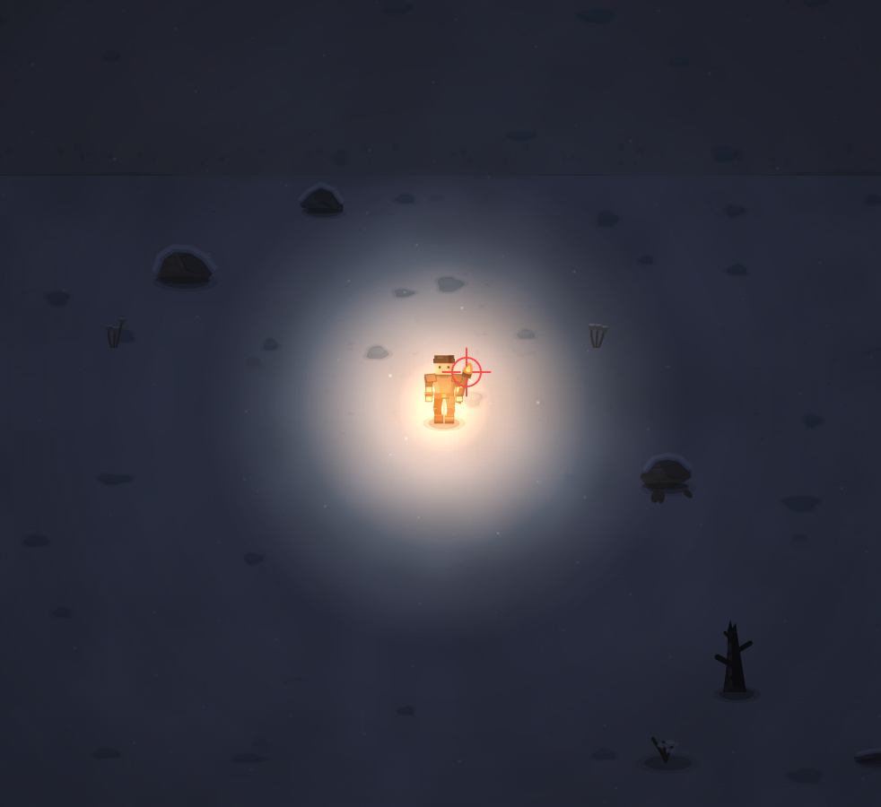

# Свечение от факела происходит из центра игрока, а не от факела

- **зона:** Пепелище у дома (`ashfall`)
- **точка:** x 564, y 1051 (тайл 17,32)
- **время:** день 85, 02:11, winter
- **погода:** snow
- **зум:** 2.4
- **повторить:** `node tools/scene.js --zone ashfall --at 564,1051 --day 85 --hour 2.183333333333333 --weather snow --wet 0.6252083333333386 --zoom 2.4 --seed 1066618561`

<!-- 2026-10-07T12:12:17.465Z -->

## Обработка — 2026-10-07, этап 57

**Статус:** Исправлено. Код: `5dc481f`.

Положение света вычисляется из позы правой руки и поворота факела, включая шаг, действие, диагональ и падение. Карта света и тени получают один мировой источник у пламени вместо player.y - 8. Пиксельный тест сопоставляет видимое пламя с якорем во всех четырёх направлениях. Слабая адаптация зрения в шахте остаётся отдельным, приглушённым при факеле источником.

Проверки: `npm test` — 244/244; `npm run environment` — воспроизведение
с числовым сидом и контекстом заметки. Кадры проверены в софт-рендере;
нативная браузерная приёмка владельцем — в превью. Исходная заметка и PNG
сохранены. Подробности: [CHANGELOG, этап 57](../CHANGELOG.md).
