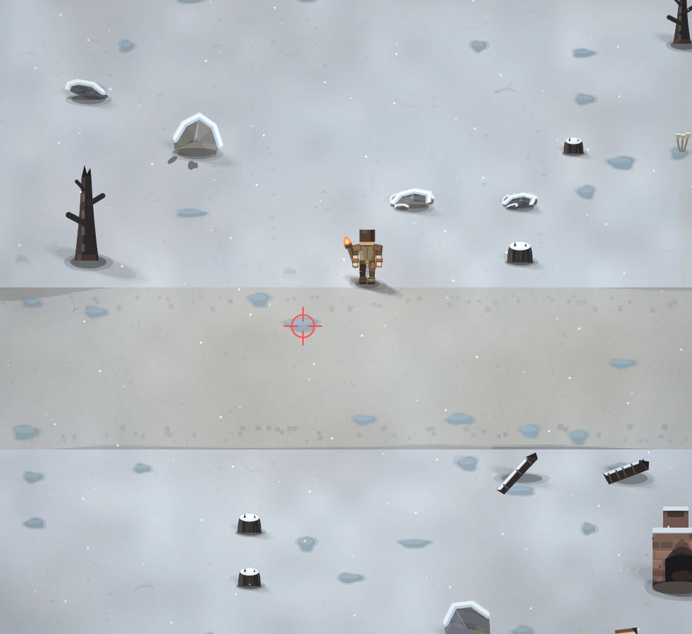

# зимой лужа превращается в лед и становится скользко. Есть вероятность потерять равновесие и упасть

- **зона:** Пепелище у дома (`ashfall`)
- **точка:** x 848, y 887 (тайл 26,27)
- **время:** день 85, 15:30, winter
- **погода:** snow
- **зум:** 2.4
- **повторить:** `node tools/scene.js --zone ashfall --at 848,887 --day 85 --hour 15.5 --weather snow --wet 0.7964583333333349 --zoom 2.4 --seed 1066618561`

<!-- 2026-10-07T12:10:41.011Z -->

## Обработка — 2026-10-07, этап 57

**Статус:** Реализовано. Код: `5dc481f`.

Дождевые лужи зимой становятся голубым льдом с трещинами. Скользит именно лужа, а не весь заснеженный тайл; море остаётся непроходимым. Бег и резкий разворот дают детерминированный шанс падения, расход выносливости, короткую позу падения и автоматическое восстановление управления. Есть защита от немедленного повторного падения, проверка столкновений и сохранение состояния. Зимний лёд не высыхает как летняя вода; весной снова действует обычное высыхание.

Проверки: `npm test` — 244/244; `npm run environment` — воспроизведение
с числовым сидом и контекстом заметки. Кадры проверены в софт-рендере;
нативная браузерная приёмка владельцем — в превью. Исходная заметка и PNG
сохранены. Подробности: [CHANGELOG, этап 57](../CHANGELOG.md).
