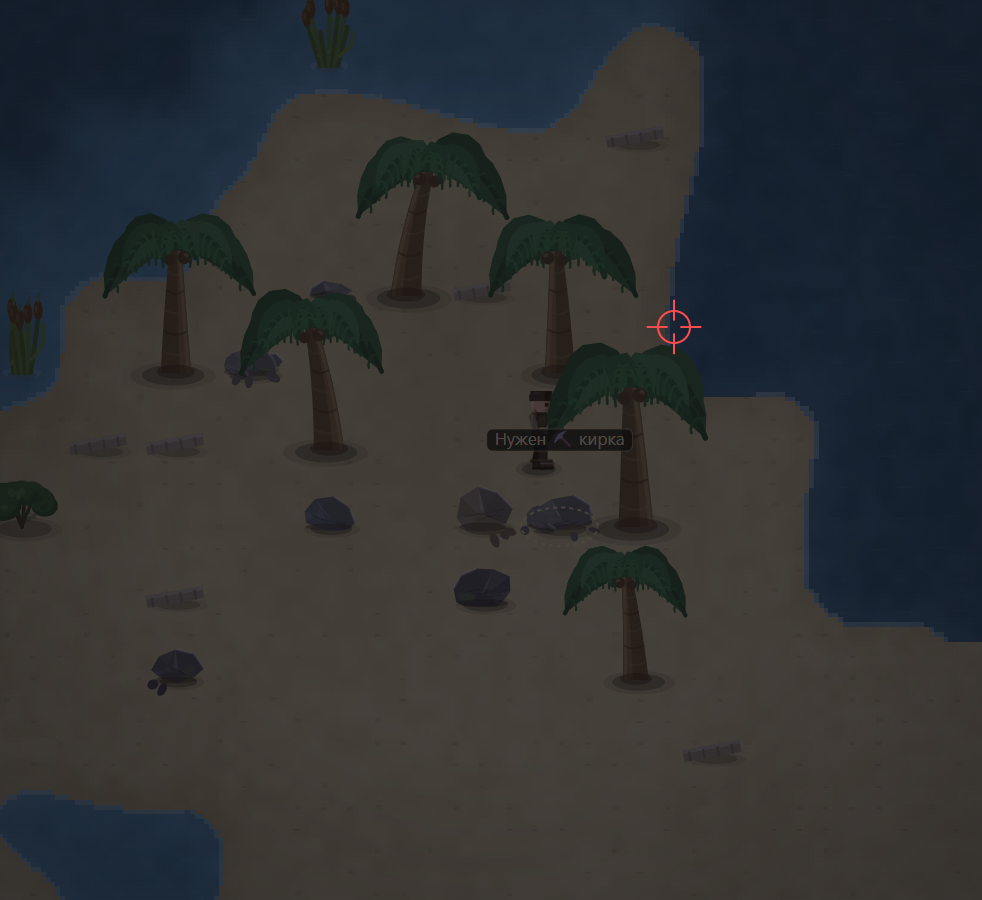

# края тоже исправь, чтоб плавно было, не сразу глубина и тд, а мелководье

- **зона:** Лазурный берег (`shore`)
- **точка:** x 2432, y 637 (тайл 76,19)
- **время:** день 1, 21:27, spring
- **погода:** cloudy
- **зум:** 2.4
- **повторить:** `node tools/scene.js --zone shore --at 2432,637 --day 1 --hour 21.45 --weather cloudy --wet 0 --zoom 2.4 --seed 1066618561`

<!-- 2026-10-07T14:01:27.331Z -->

## Обработка — 2026-10-07, этап 58

**Статус:** Реализовано; ожидает визуальной приёмки владельцем. Код: `79a472f`.

Окончательная глубина вычисляется после восстановления берега и границ. Первый водный тайл у суши остаётся мелководьем, в том числе на краю карты. Цвет воды меняется по непрерывному расстоянию от суши: мокрый песок → прозрачная прибрежная вода → бирюза → глубина. Море не превращено в проход; острова и ресурсы не удалены.

Проверки: 266/266 тестов; `npm run visual` — целевой софт-рендер;
короткий `npm run play -- 30` — 381 проверка, 0 нарушений.
Исходная заметка и PNG сохранены. Нативный браузер здесь не запускался.
Подробности: [CHANGELOG, этап 58](../CHANGELOG.md).
