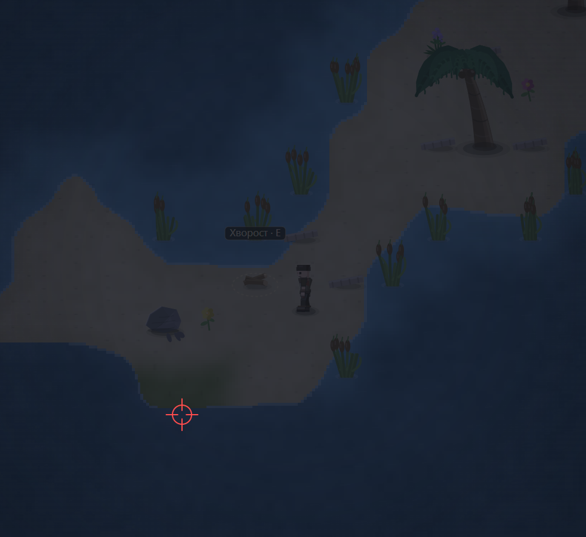

# и здесь тоже плавный

- **зона:** Лазурный берег (`shore`)
- **точка:** x 1661, y 1707 (тайл 51,53)
- **время:** день 2, 00:57, spring
- **погода:** clear
- **зум:** 2.4
- **повторить:** `node tools/scene.js --zone shore --at 1661,1707 --day 2 --hour 0.95 --weather clear --wet 0 --zoom 2.4 --seed 1066618561`

<!-- 2026-10-07T14:03:54.297Z -->

## Обработка — 2026-10-07, этап 58

**Статус:** Реализовано; ожидает визуальной приёмки владельцем. Код: `79a472f`.

Тот же общий расчёт береговой дистанции и окончательной глубины, что для 014: переход больше не зависит от одной дискретной границы WATER/DEEP. Проверены исходный ночной контекст и дневной вид. Отдельного частного патча этой точки нет.

Проверки: 266/266 тестов; `npm run visual` — целевой софт-рендер;
короткий `npm run play -- 30` — 381 проверка, 0 нарушений.
Исходная заметка и PNG сохранены. Нативный браузер здесь не запускался.
Подробности: [CHANGELOG, этап 58](../CHANGELOG.md).
