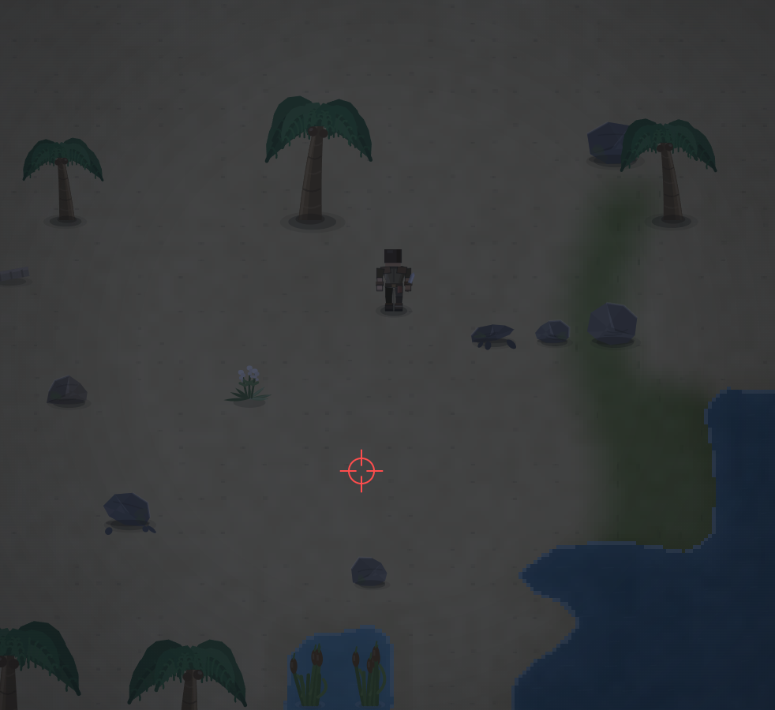

# Убираем генерацию больших камней на пляже. Где вообще на пляже есть большие камни?

- **зона:** Лазурный берег (`shore`)
- **точка:** x 2315, y 1173 (тайл 72,36)
- **время:** день 2, 03:56, spring
- **погода:** clear
- **зум:** 2.4
- **повторить:** `node tools/scene.js --zone shore --at 2315,1173 --day 2 --hour 3.9333333333333336 --weather clear --wet 0 --zoom 2.4 --seed 1066618561`

<!-- 2026-10-07T14:05:59.449Z -->
