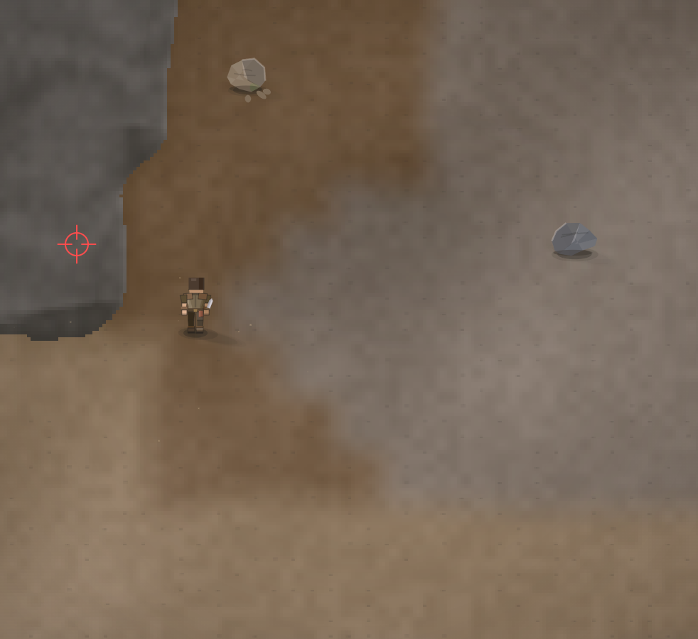

# края игры можно сделать более оживленным. Думаю будет интересно, если постепенно развивать всё. Но а пока как то давай что-то по типу холмов и гор.Или какой то густой лес.

- **зона:** Пепелище у дома (`ashfall`)
- **точка:** x 45, y 715 (тайл 1,22)
- **время:** день 2, 06:39, spring
- **погода:** clear
- **зум:** 2.4
- **повторить:** `node tools/scene.js --zone ashfall --at 45,715 --day 2 --hour 6.65 --weather clear --wet 0 --zoom 2.4 --seed 1066618561`

<!-- 2026-10-07T14:07:53.738Z -->
