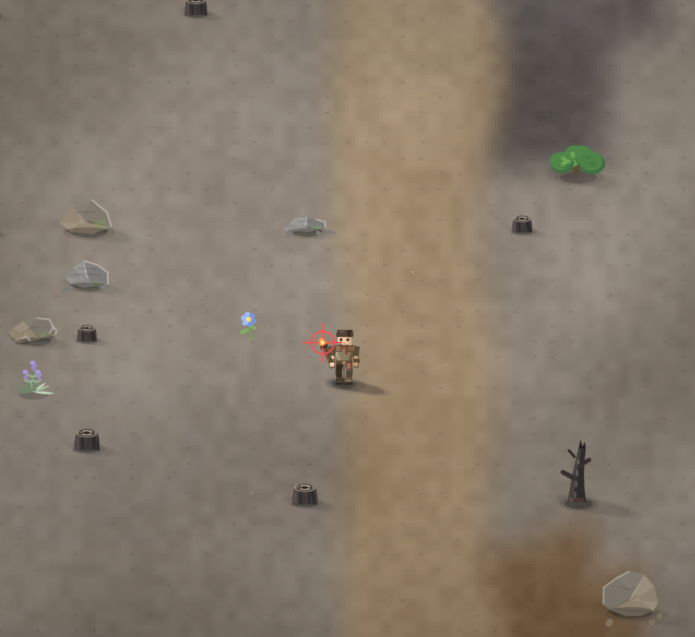

# давай сделаем, чтоб и пламя факела было анимированным как костёр

- **зона:** Пепелище у дома (`ashfall`)
- **точка:** x 1083, y 434 (тайл 33,13)
- **время:** день 2, 08:57, spring
- **погода:** clear
- **зум:** 2.4
- **повторить:** `node tools/scene.js --zone ashfall --at 1083,434 --day 2 --hour 8.95 --weather clear --wet 0 --zoom 2.4 --seed 1066618561`

<!-- 2026-10-07T14:09:30.777Z -->
