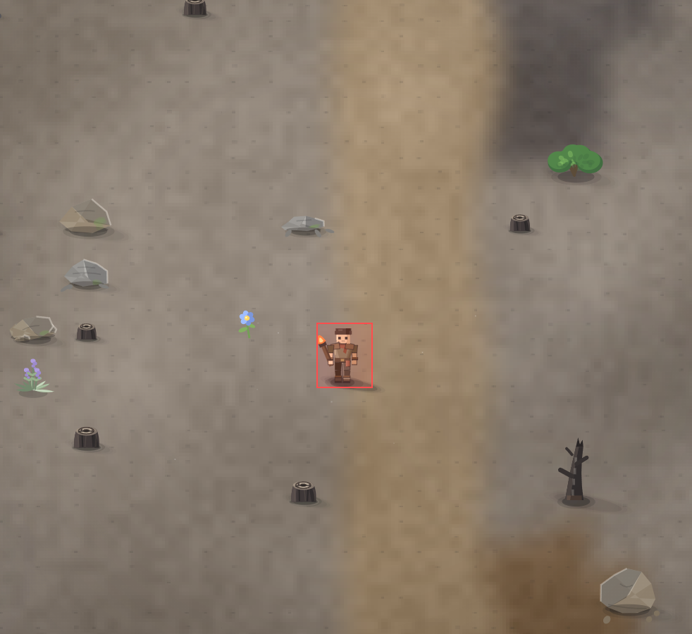

# мы можем как то улучшить вид самого игрока?

**Актуальный статус · 2026-10-09, блок 64:** Владелец не принял визуальное изменение (027). Нужна существенная переработка героя, не косметическая смена палитры.

[Полный аудит](../NOTES-AUDIT-2026-10-09.md).

- **зона:** Пепелище у дома (`ashfall`)
- **область:** 33×38 px от (1080, 423) — тайлы 33,13 … 34,14
- **время:** день 2, 09:39, spring
- **погода:** clear
- **зум:** 2.4
- **повторить:** `node tools/scene.js --zone ashfall --at 1097,442 --day 2 --hour 9.65 --weather clear --wet 0 --zoom 2.4 --seed 1066618561`

<!-- 2026-10-07T14:09:59.845Z -->

## Обработка — 2026-10-07, этап 58

**Статус:** Реализовано; ожидает визуальной приёмки владельцем. Код: `79a472f`.

Переработаны пропорции головы/плеч/рук, силуэт лица, волосы, челюсть, профиль и вид со спины. Вместо громоздких стандартных накладок — одежда, диагональный ремень и сумка; уточнены ботинки и палитра. Сохранены IK ног, движение, действие и правая рука. Проверены листы 4×10 поз с инструментом и факелом. Дальнейший стиль оценивает владелец, не автоматический тест.

Проверки: 266/266 тестов; `npm run visual` — целевой софт-рендер;
короткий `npm run play -- 30` — 381 проверка, 0 нарушений.
Исходная заметка и PNG сохранены. Нативный браузер здесь не запускался.
Подробности: [CHANGELOG, этап 58](../CHANGELOG.md).

### Этап 63 · 2026-10-09 · `8994119`
Владелец повторно запросил улучшение героя. Уменьшены голова/толщина ног и
ботинок, уточнён силуэт плеч, добавлен многослойный жилет поверх светлой
рубахи, обновлена палитра. Руки/предметы остаются анатомически согласованы.
Проверены листы направлений/диагоналей и дневной/ночной/зимний участок.
**Новая версия для оценки, не художественная приёмка.**
