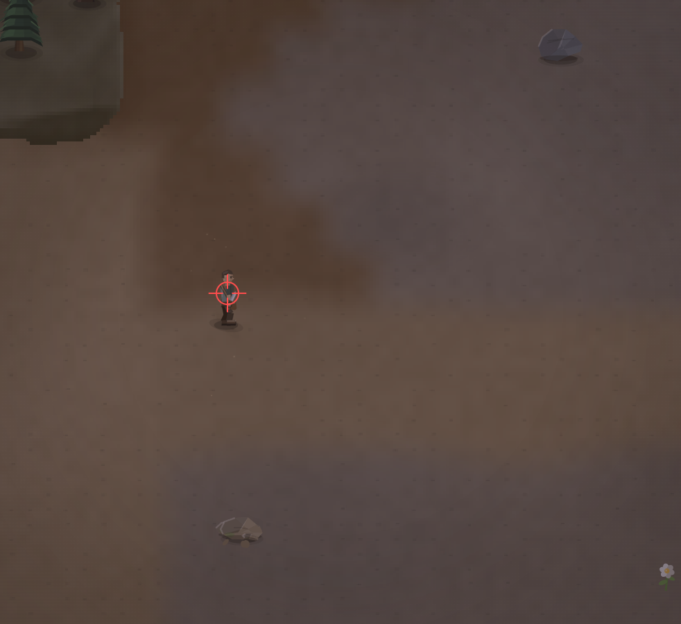

# Перс выглядит не очень. При беге по наклонной, в направлениях w+a|w+d|s+a|s+d бывает ломается анимка, и получается  игрок начинает трястись.

- **зона:** Пепелище у дома (`ashfall`)
- **точка:** x 137, y 861 (тайл 4,26)
- **время:** день 1, 19:55, spring
- **погода:** cloudy
- **зум:** 2.4
- **повторить:** `node tools/scene.js --zone ashfall --at 137,861 --day 1 --hour 19.916666666666668 --weather cloudy --wet 0 --zoom 2.4 --seed 1066618561`

<!-- 2026-10-07T16:50:16.814Z -->
