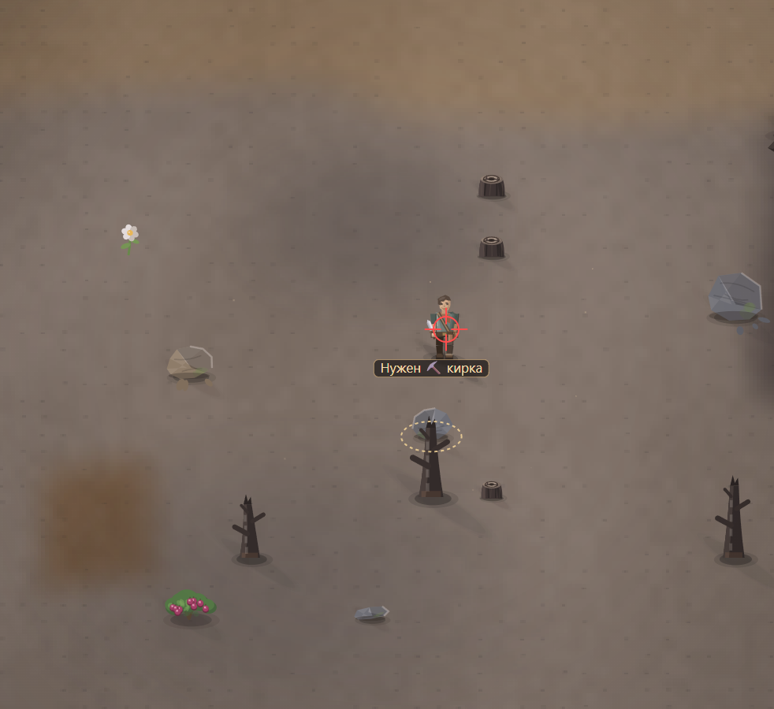

# При движении бегом по диагонали внизу в стороны, снова есть тряска. Улучши и самого игрока, вид у него не очень

- **зона:** Пепелище у дома (`ashfall`)
- **точка:** x 792, y 1079 (тайл 24,33)
- **время:** день 1, 18:18, spring
- **погода:** cloudy
- **зум:** 2.4
- **повторить:** `node tools/scene.js --zone ashfall --at 792,1079 --day 1 --hour 18.3 --weather cloudy --wet 0 --zoom 2.4 --seed 1066618561`

<!-- 2026-10-07T17:44:49.995Z -->
