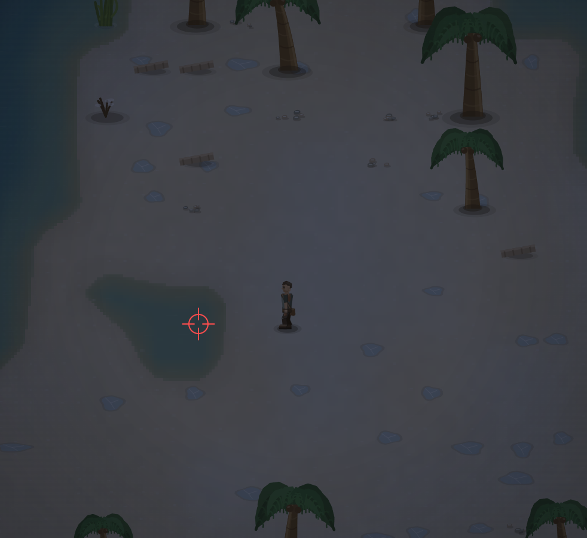

# Вот прилежающие воды, что не стыкуются с морем должны быть во льду, да и море так то должно быть во льду, но смена времени и погоды никак на это не влияет. То есть механика не до конца проработана.

- **зона:** Лазурный берег (`shore`)
- **точка:** x 2225, y 865 (тайл 69,27)
- **время:** день 85, 21:22, winter
- **погода:** cloudy
- **зум:** 2.4
- **повторить:** `node tools/scene.js --zone shore --at 2225,865 --day 85 --hour 21.366666666666667 --weather cloudy --wet 1 --zoom 2.4 --seed 1066618561`

<!-- 2026-10-07T17:46:59.362Z -->

---

### Этап 60 · 2026-10-07 · `25987c2`

Водоёмы теперь получают общее для изображения/физики состояние льда.
Море определяется связностью воды с краем береговой карты, отделённые
водоёмы — пресные. При зимнем холоде появляются светлый лёд и трещины;
на покрытых участках убраны рябь, отражение/ободок воды у ног и брызги.
Состояние зависит от температуры, значит от дня/ночи, погоды и биома;
рендер обновляет чанки при смене ступени покрытия. На точке заметки
ночью/cloudy — замёрзший водоём, днём/cloudy — оттепель, днём/snow — лёд.

Крепкий пресный лёд проходим и скользит. **Морская глубина не проходима**,
даже с видимым льдом. Генерация суши, острова и ресурсы не менялись.
При оттепели внутри глубины действует безопасный перенос на землю.

Статус: **реализована ограниченная сезонная модель**. Накопление толщины,
тепловая история, проламывание и плавание ещё не моделируются. Тесты
проверяют ночное/дневное состояние, погоду, чанки, связность и блокировку
всех морских DEEP-ячеек. Исходный текст/PNG сохранены.
