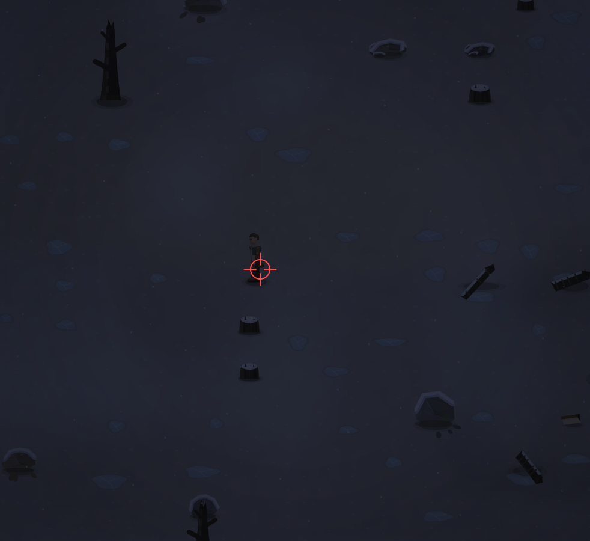

# Вот ты поставил ограничения на бег при низком выносливости или чо там было, но если при этом использовать бег, игрока снова трясеть. К тому же у меня выносливость  же высокая или где вообще показана выносливость?

- **зона:** Пепелище у дома (`ashfall`)
- **точка:** x 824, y 965 (тайл 25,30)
- **время:** день 86, 00:28, winter
- **погода:** snow
- **зум:** 2.4
- **повторить:** `node tools/scene.js --zone ashfall --at 824,965 --day 86 --hour 0.4666666666666667 --weather snow --wet 1 --zoom 2.4 --seed 1066618561`

<!-- 2026-10-07T17:49:09.519Z -->

---

### Этап 60 · 2026-10-07 · `25987c2`

Причина различия «сил» и бега: HUD показывал 100−fatigue, но не
Player.stamina. Теперь видны отдельные подписанные **Бодрость** и
**Выносливость**, текущий запас и объяснение ограничения.

Прежний гистерезис лишь делал повторные разгоны реже. Теперь после
истощения бег блокируется **до отпускания Shift**, затем нужен запас >18%.
На 824,965, четыре диагонали ×4 с, stamina=6.05: **8 → 0** смен бег/шаг
суммарно. Дополнительно проверено удержание 30 с и повторное нажатие.
Максимальный скачок bob **0.4135 → 0.1119**; поза, сетка деталей и якорь
отрисовки доработаны вместе с 021.

Статус: логика/HUD исправлены и покрыты регрессиями; **плавность и внешний
вид требуют ручной приёмки**, прежняя проверка 020 её не заменяет.
