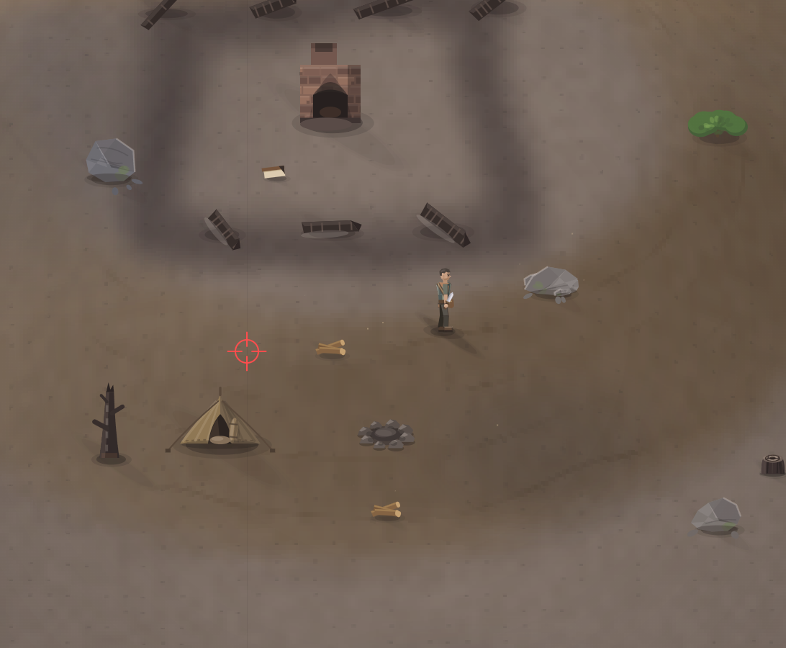

# При движении появляется какая та полоса, проверь ка.

- **зона:** Пепелище у дома (`ashfall`)
- **точка:** x 1024, y 1165 (тайл 32,36)
- **время:** день 1, 18:19, spring
- **погода:** cloudy
- **зум:** 2.4
- **повторить:** `node tools/scene.js --zone ashfall --at 1024,1165 --day 1 --hour 18.316666666666666 --weather cloudy --wet 0 --zoom 2.4 --seed 1066618561`

<!-- 2026-10-09T05:29:06.318Z -->
