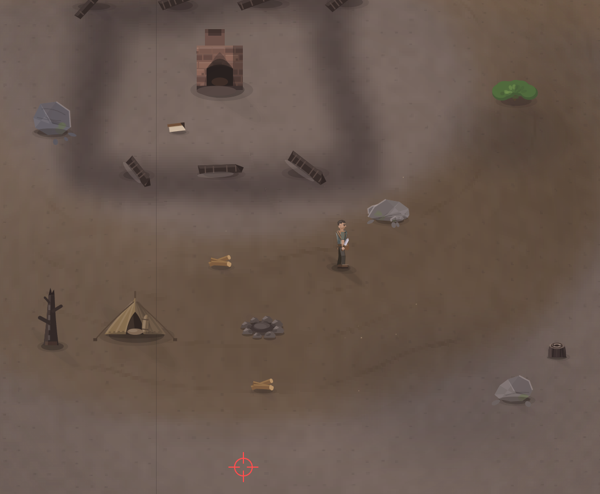

# Я говорил убрал все подсказки, и что за кнопка V?

- **зона:** Пепелище у дома (`ashfall`)
- **точка:** x 1090, y 1283 (тайл 34,40)
- **время:** день 1, 18:57, spring
- **погода:** cloudy
- **зум:** 2.4
- **повторить:** `node tools/scene.js --zone ashfall --at 1090,1283 --day 1 --hour 18.95 --weather cloudy --wet 0 --zoom 2.4 --seed 1066618561`

<!-- 2026-10-09T05:30:00.135Z -->
